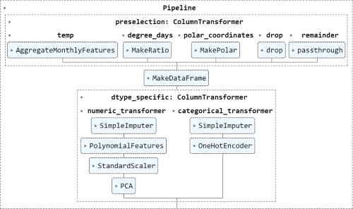
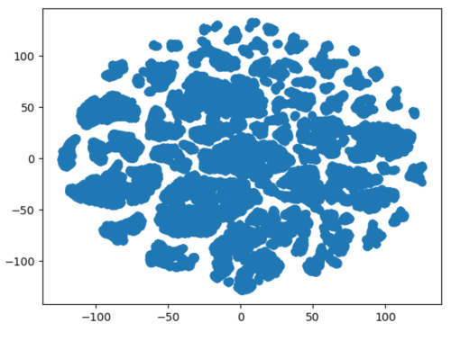

# Predicting the energy consumption of a building

--- University Research Project ---

## Task
Given detailed characteristics of buildings, the goal is to predict their Energy Usage Intensity (EUI).
The quality of a given model is evaluated using the Root Mean Squared Error (RMSE).
For more details see the [task file](task.pdf) provided by the professor.

## Approach
- Initial exploration of the dataset to get familiar with available characteristics, present datatypes and more technical aspects like missing data or distributions of characteristics. [Jupyter Notebook File](data_exploration.ipynb)
- Training pof a first simple linear regression model on numerical characteristics only as a baseline model for the more sophisticated approaches. [Jupyter Notebook File](baseline_model.ipynb)
  - baseline score on __train__ set: 50.17 RMSE
- Building an end-to-end pipeline for preprocessing and regression. [Jupyter Notebook File](final_pipeline.ipynb)
  - preprocessing data pipeline
  - model selection using k-fold cross validation for a hyperparameter grid search
  - data visualization using t-SNE
  - final evaluation on the __test__ set: 43.54 RMSE

